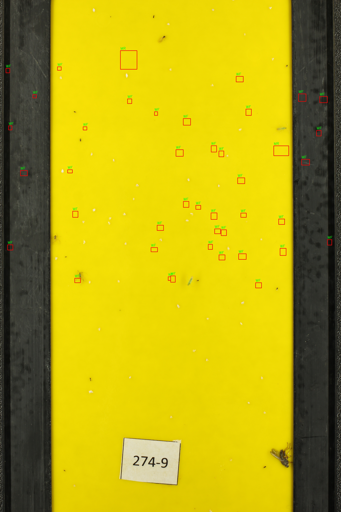
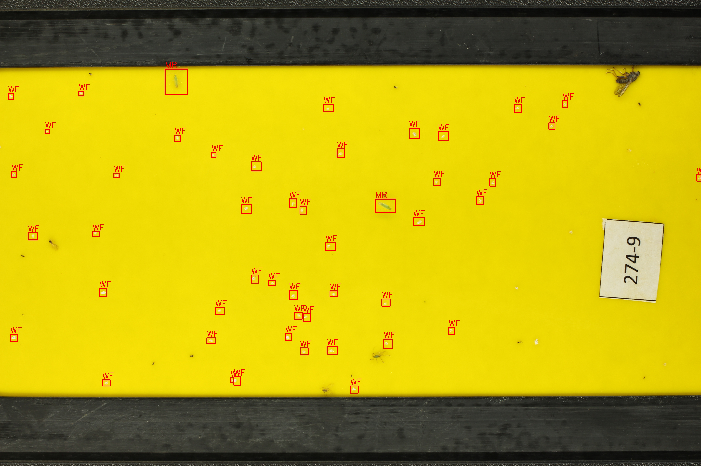
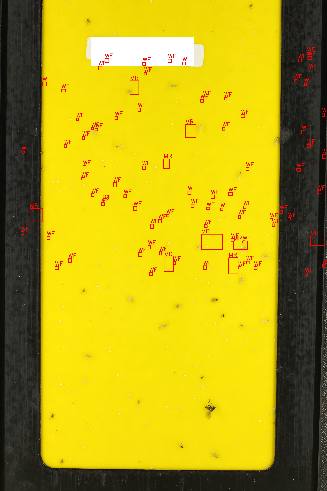
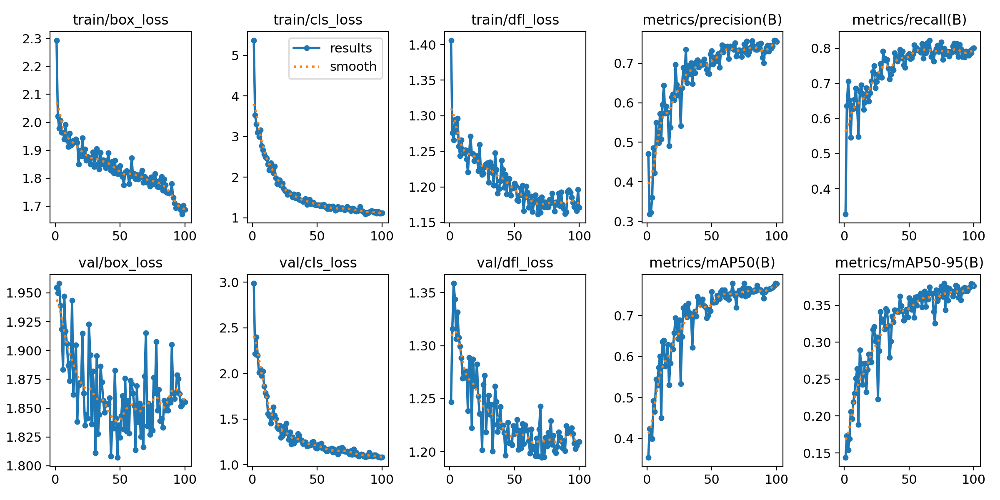
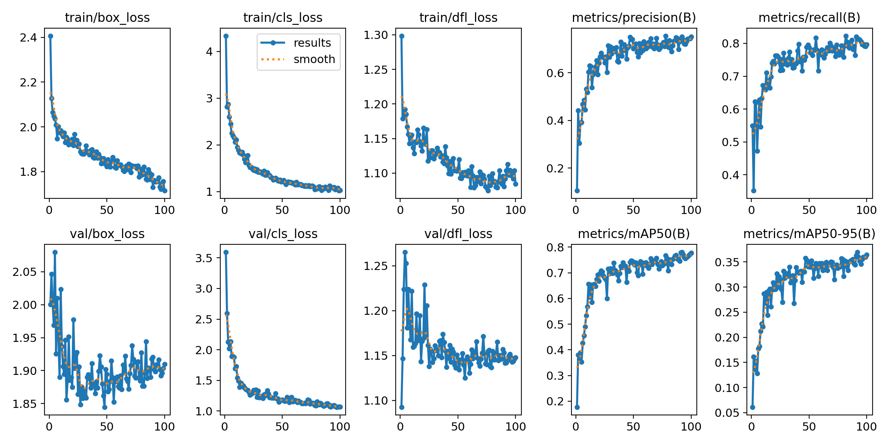
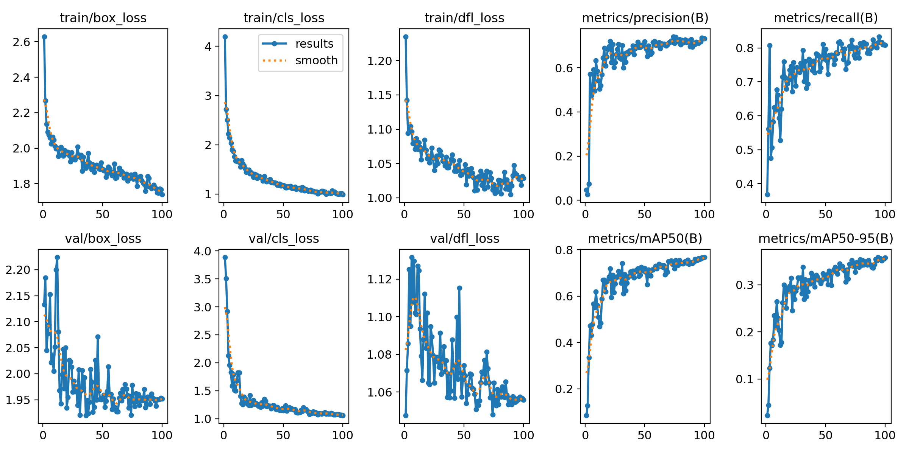

# Yellow Sticky Traps Dataset – A Practical Debugging Journey

## My Workflow and Lessons Learned

### 1. Download and First Inspection

After downloading the [Kaggle Yellow Sticky Traps dataset](https://www.kaggle.com/datasets/friso1987/yellow-sticky-traps/data), I started by **printing out a few images** to check the content and the annotation overlay.  
To do this, I wrote `print.py` to simply open and display each image.

  
*Figure: Example of a portrait image with misaligned bounding boxes (`1000_preview.jpg`).*

#### Key finding:
- Some images were in **portrait**, others in **landscape**.
- All XML annotation files assumed **landscape orientation**.
- When plotting bounding boxes on portrait images, **annotations were misaligned**.

---

### 2. The First Attempt at Fixing Rotation

Thinking the problem was only with portrait images, I tried to rotate all images by 90 degrees using a script (`print_90.py`).  
But this approach **didn’t solve the problem**—in fact, it broke the alignment for the landscape images! Now both types could end up mismatched with their annotations, depending on the original orientation.

  
*Figure: Rotating a portrait image aligned the boxes (`1000_rotated_annotated.jpg`).*

  
*Figure: Rotating a landscape image misaligned the boxes (`1170_rotated_annotated.jpg`).*

#### Lesson:
- Rotating everything blindly is not enough.  
- The dataset contained **both portrait and landscape images**; only portrait images needed rotation.

---

### 3. The Final Fix: Smart Orientation Script

I developed `fix_dataset.py` to **automatically check the orientation of each image** and only rotate those in portrait mode (height > width).  
After running this, all images matched their respective annotation files, and bounding boxes aligned perfectly.

#### What the script does:
- Checks each image’s height and width.
- Rotates only those where height > width.
- Leaves landscape images unchanged.

---


### 4. Converting VOC XML Annotations to YOLO Format

With all images now properly oriented, the next challenge was to **convert the annotation format**. The original dataset provides bounding boxes in Pascal VOC XML, while YOLO requires a simple TXT format with normalized coordinates.

To automate this, I created a script that:
- **Scans the dataset folder** (`sticky_dataset/stickytraps`) for each image/XML pair.
- **Maps each object class abbreviation** (e.g., WF, MR, NC) to the correct YOLO class index.
- **Calculates normalized bounding box coordinates** based on the actual image size.
- **Skips boxes or objects that are out-of-bounds or have unknown classes.**
- **Writes YOLO-format `.txt` files** for each image, ready for training.

This process was essential to make the dataset compatible with Ultralytics YOLOv8.

### 5. Splitting the Dataset and Generating the YOLO Dataset YAML

With all images and annotations now converted to YOLO format, the next step was to **split the dataset into training and validation sets**, and to organize the files in the structure expected by YOLOv8.

I created a script to:
- **Randomly shuffle** all images.
- **Split the dataset** into 80% for training and 20% for validation.
- **Copy images and their corresponding YOLO annotation `.txt` files** into subfolders:
    - `images/train/` and `labels/train/`
    - `images/val/` and `labels/val/`
    (all inside the new dataset directory, e.g., `sticky_dataset/16mpx/`)
- **Automatically generate the `dataset.yaml` file** required by Ultralytics YOLO, listing the correct paths and class names.

This ensures the dataset is in the right format for a smooth YOLO training experience.

### 6. Training with 16 MPX Images

## command used
```bash
  yolo detect train \ data=sticky_dataset/16mpx/dataset.yaml \ epochs=100 \ imgsz=2560 \ batch=8 \ project=. \ name=16mpx
```

### YOLOv8 Training Results (imgsz=2560, epochs=100)

| Class         | Images | Instances | Precision | Recall | mAP50 | mAP50-95 |
|:--------------|-------:|----------:|----------:|-------:|------:|---------:|
| **All**       |     56 |      1670 |     0.758 |  0.786 | 0.772 |   0.378  |
| Macrolophus   |     33 |       296 |     0.791 |  0.869 | 0.831 |   0.397  |
| Nesidiocoris  |     14 |        81 |     0.693 |  0.889 | 0.808 |   0.478  |
| Whitefly      |     37 |      1293 |     0.790 |  0.599 | 0.676 |   0.258  |

  
*Figure: Example of the model’s training performance and validation metrics over 100 epochs. The plot summarizes loss curves, mAP, and accuracy.*

### 7. Training with 5 MPX Images

## command used
```bash
  yolo detect train \ data=sticky_dataset/16mpx/dataset.yaml \ epochs=100 \ imgsz=1920 \ batch=4 \ project=. \ name=5mpx
```

### YOLOv8 Training Results (imgsz=1920, epochs=100)

| Class        | Images | Instances | Precision | Recall | mAP50 | mAP50-95 |
| :----------- | -----: | --------: | --------: | -----: | -----:| --------:|
| **All**      |     56 |     1670  |   0.754   | 0.813  | 0.781 |   0.370  |
| Macrolophus  |     33 |      296  |   0.779   | 0.851  | 0.799 |   0.367  |
| Nesidiocoris |     14 |       81  |   0.715   | 0.901  | 0.845 |   0.491  |
| Whitefly     |     37 |     1293  |   0.768   | 0.686  | 0.700 |   0.252  |

  
*Figure: Example of the model’s training performance and validation metrics over 100 epochs. The plot summarizes loss curves, mAP, and accuracy.*


### 8. Training with 2 MPX Images

## command used
```bash
  yolo detect train \ data=sticky_dataset/16mpx/dataset.yaml \ epochs=100 \ imgsz=1408 \ batch=8 \ project=. \ name=5mpx
```

### YOLOv8 Training Results (imgsz=1920, epochs=100)

| Class        | Images | Instances | Precision | Recall | mAP50 | mAP50-95 |
| :----------- | -----: | --------: | --------: | -----: | -----:| --------:|
| **All**      |     56 |     1670  |   0.736   | 0.810  | 0.771 |   0.357  |
| Macrolophus  |     33 |      296  |   0.785   | 0.837  | 0.835 |   0.368  |
| Nesidiocoris |     14 |       81  |   0.696   | 0.901  | 0.815 |   0.462  |
| Whitefly     |     37 |     1293  |   0.726   | 0.691  | 0.664 |   0.240  |

  
*Figure: Example of the model’s training performance and validation metrics over 100 epochs. The plot summarizes loss curves, mAP, and accuracy.*

### 9. Comparative Analysis and Model Selection

After training and validating YOLOv8 models at three different input resolutions—**16MPX (imgsz=2560)**, **5MPX (imgsz=1920)**, and **2MPX (imgsz=1408)**—it became clear that image resolution plays an important role in both overall performance and resource consumption.

#### **Results Overview:**

- The **16MPX model** (imgsz=2560) delivered high precision for all classes, especially Macrolophus and Whitefly, but recall was noticeably lower for Whitefly, likely due to missed detections of small or poorly labeled individuals. The computational cost and VRAM required were also substantially higher.
- The **2MPX model** (imgsz=1408) was lighter and faster to train, but the drop in both precision and mAP indicates some loss in the model’s ability to detect smaller or less distinct objects, as shown by a slight decrease in performance across all metrics.
- The **5MPX model** (imgsz=1920) achieved the **best balance** between precision, recall, and mAP, particularly for the critical Nesidiocoris and Whitefly classes. Its performance is consistently high, while requiring less GPU memory and computational resources than the 16MPX model.

#### **Why choose 5MPX?**

The 5MPX configuration stands out as the most balanced choice. It provides competitive detection performance for all classes, and especially improves recall for Whitefly and Nesidiocoris compared to the highest resolution. This means the model is more likely to catch true positives, even in challenging or cluttered backgrounds, without the heavy computational cost of 16MPX training.

#### **Dataset Labeling Issue:**

It’s important to highlight that **the dataset is producing a significant number of false positives** during validation and testing. This is not necessarily a model problem, but a dataset limitation:  
> **Many insects are present in the images but were not annotated by the original dataset authors.**

As a result, when the model detects these “unlabeled” insects, they are counted as false positives, unfairly penalizing the precision and mAP metrics. This highlights the importance of high-quality, exhaustive annotation for robust model evaluation.

#### **Conclusion:**

Given the trade-off between accuracy, recall, and resource requirements—and considering the current state of the dataset—the **5MPX (imgsz=1920) model** is the best choice for further development and deployment. Future work should include revising and completing the annotation set to provide a fairer, more realistic evaluation of model performance.